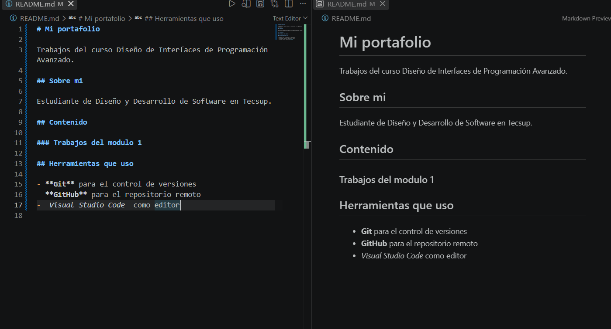

# Mi portafolio

Trabajos del curso Diseño de Interfaces de Programación Avanzado.

## Sobre mi

Estudiante de Diseño y Desarrollo de Software en Tecsup.

## Contenido

### Trabajos del modulo 1

## Herramientas que uso

- **Git** para el control de versiones
- **GitHub** para el repositorio remoto
- _Visual Studio Code_ como editor

## Enlaces utiles

- [Guia oficial de Markdown](https://www.markdownguide.org/)
- [Mi perfil de GitHub](https://github.com/TU-USUARIO)

## Captura de mi trabajo

